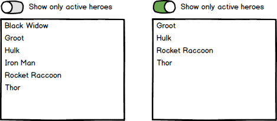

# @softeq/angular-route-data

`@softeq/angular-route-data` allows to keep URL up to date with the page content.

#### Motivation

Let's consider the following example to understand what problem this library tries to solve.  
Imagine we have a page under the route `/heroes` displaying list of heroes and toggle that allows to *show only active heroes*.



When user turns switch on we need to show only active heroes and update URL to `/heroes?onlyActive=true`. In addition user can open this URL by putting it into the address bar of the browser and go to the same page having switch *show only active heroes* on.  
In the real world, page can have more criteria, like name of hero, set of checkboxes, etc.
Such behavior allows user to keep bookmarkable URLs or send URLs via messenger. For developer it can simplify implementation of back behavior (when user press on browser *back* button).

#### Example

The following code demonstrates behavior described in [Motivation](#motivation) section.
```typescript
interface Hero {
  name: string;
  active: boolean;
}

@Component({
  selector: 'hero-list',
  template: `
    <mat-slide-toggle [formControl]="onlyActiveControl">Show only active heroes</mat-slide-toggle>
    <mat-list>
      <mat-list-item *ngFor="let hero of filteredHeroes">{{ hero.name }}</mat-list-item>
    </mat-list>
  `,
})
export class HeroListComponent implements OnInit {
  onlyActiveControl = new FormControl(false);
  heroes: Hero[] = [
    { name: 'Black Widow', active: false },
    { name: 'Groot', active: true },
    { name: 'Hulk', active: true },
    { name: 'Iron Man', active: false },
    { name: 'Rocket Raccoon', active: true },
    { name: 'Thor', active: true },
  ];
  filteredHeroes: Hero[];

  constructor(private route: ActivatedRoute,
              private routeData: RouteDataService) {
  
  }

  ngOnInit(): void {
    const tracker = this.routeData.tracker(controlTracker('onlyActive', this.onlyActiveControl, booleanMapper()));

    tracker.listen(this.route);
    tracker.filterChanges.subscribe(([onlyActive]) => {
      this.filteredHeroes = onlyActive ? this.heroes.filter((hero) => hero.active) : this.heroes;
    });
  }
}
```

Here we track value of `onlyActiveControl` and URL of the current page.  
If user switches value of control, URL and set of `filteredHeroes` are updated correspondingly.  
From the other side when user opens page by `/heroes?onlyActive=true` URL, `onlyActiveControl` is already set to `true` and list of heroes shows only active heroes.

Let's consider this code in more details.  

1. All tracking logic is provided by `RouteDataService`. Also we need `ActivatedRoute` from `@angular/router` package to track route parameters
    ```typescript
    constructor(private route: ActivatedRoute,
                private routeData: RouteDataService)
    ```

1. Create instance of `RouteTracker`. `RouteTracker` is a key entity for tracking behavior. It can be created using `RouteDataService.tracker` method.
    ```typescript
    const tracker = this.routeData.tracker(controlTracker('onlyActive', this.onlyActiveControl, booleanMapper()));
    ```
   `tracker` method accepts set of `RouteParamTracker`.  
   `RouteParamTracker` tracks subset of route query parameters. It is responsible for
   * tracking of route query parameters (merge query parameters into the underlying page object)
   * tracking of filter changes (notify when underlying page object has changed, like toggling of switch or changing of text value);
   * notifying about new query parameters (generate set of query parameters to be merged into the current URL)

   In our example the following code create `RouteParamTracker`
    ```typescript
    controlTracker('onlyActive', this.onlyActiveControl, booleanMapper())
    ```
   which tracks value of `onlyActive` query parameter, mirrors its value in the instance of `FormControl` (`onlyActiveControl`) and treats this value as `boolean` (using `booleanMapper()`. It is important to map query parameter value, because query parameter is always a `string`).
   
   This way `RouteParamTracker` created by `controlTracker`
   * merges value of `onlyActive` query parameter into the `onlyActiveControl`
   * notifies about new value coming from `onlyActiveControl` when user toggles switch
   * and emits new value of `onlyActive` query parameter when user toggles switch

1. Bind route to the instance of `RouteTracker`
    ```typescript
    tracker.listen(this.route);
    ```
   This way `RouteTracker` can listen for changes in route query parameters.

1. Update displayed data when filter is changed
    ```typescript
    tracker.filterChanges.subscribe(([onlyActive]) => {
      this.filteredHeroes = onlyActive ? this.heroes.filter((hero) => hero.active) : this.heroes;
    });
    ```
   `filterChanges` emits new value as soon as one of assigned `RouteParamTracker`s notifies about changes.

#### Default value

What if value of `onlyActiveControl` from the [Example](#example) section should be set to `true` by default.  
This way when user opens the page by URL `/heroes`, he should see switch *Show only active heroes* in toggled state. When user clicks on switch, URL become `/heroes?onlyActive=false`. One more click makes URL `/heroes?onlyActive=true` and shows only active heroes again.  
There is no big sense to set `onlyActive=true` when `true` is a default value. From the perspective of page content URLs `/heroes` and `/heroes?onlyActive=true` are the same.  
In order to hide query parameter when it accepts default value, you can tell `RouteParamTracker` what value is a default one.

```typescript
const tracker = this.routeData
  .tracker(controlTracker('onlyActive', this.onlyActiveControl, booleanMapper()).withDefault(true));
```

#### Filters and effects

`RouteParamTracker` can be registered as *filter* or *effect*. Example of *filter* `RouteParamTracker` was shown in the [Example section](#example). *Effect* `RouteParamTracker` is used when you need to avoid dramatic changes in UI.
  
Look at the following snippet.  
Say, you need to track scroll position and save it in the URL like `/heroes?onlyActive=true&scroll=150`. This allows to open page on the same scroll position it had before.
```typescript
const tracker = this.routeData.tracker(
  controlTracker('onlyActive', this.onlyActiveControl, booleanMapper()),
  scrollTracker(...)); // this is just an example, library does not provide such tracker

tracker.listen(this.route);
tracker.filterChanges.subscribe(([onlyActive]) => {
  // filter set of heroes
});
```

Here, `scrollTracker` is registered as *filter*. It means each time scroll position is changed `filterChanges` will trigger new filter and set of `filteredHeroes` will be recalculated. This is barely expected behavior. We need the way to track scroll position, but should not emit new filter. To implement such behavior we can register `scrollTracker` as *effect*.

```typescript
const tracker = this.routeData
  .tracker(controlTracker('onlyActive', this.onlyActiveControl, booleanMapper()))
  .withEffects(scrollTracker(...));

tracker.listen(this.route);
tracker.filterChanges.subscribe(([onlyActive]) => {
  // filter set of heroes
});
```
Now scroll position will be tracked, but this will not lead to emitting of new filter.

#### Existing `RouteParamTracker`s

|`RouteParamTracker` factory|Note|
|---|---|
|`controlTracker`|Creates tracker that mirrors value of single query parameter in the provided `AbstractControl`|
|`filterTracker`|Creates tracker that mirrors value of single query parameter in the instance of `Filterable` object|
|`manualTracker`|Creates the simplest tracker that allows to track value manually and mirror it in the single query parameter|
|`observableFilterTracker`|Creates tracker that mirrors values of provided stream in the single query parameter|
|`observablePlainFilterTracker`|Creates tracker that mirrors values of provided stream in the set of query parameters|
